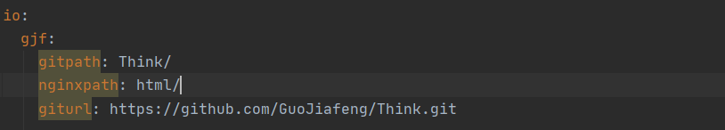

## Bolg for me 

+ 运行环境
~~~
CentOS 6 
Java 8
Git 2.3.0 
~~~

+ 安装&运行
~~~
bash <(curl -s -k -L https://raw.githubusercontent.com/GuoJiafeng/Blog/v1/install.sh)
~~~

+ 单独运行

~~~
cd ./Blog

bash <(curl -s -k -L https://raw.githubusercontent.com/GuoJiafeng/Blog/v1/run.sh)

或者

cd ./Blog

sh run.sh

后台运行

nohup sh run.sh > blog.log 2>&1 &

查看日志

tail -f blog.log
~~~

+ 说明

~~~
可以在此处进行设置,gitpath 需要和仓库名字相同。
~~~

